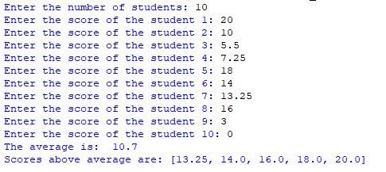

## Description
This program allows users to input the scores of a group of students, calculates the average score, and then identifies and displays the scores that are above the calculated average in ascending order. 
## Example

