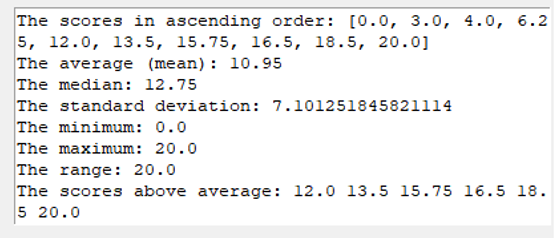
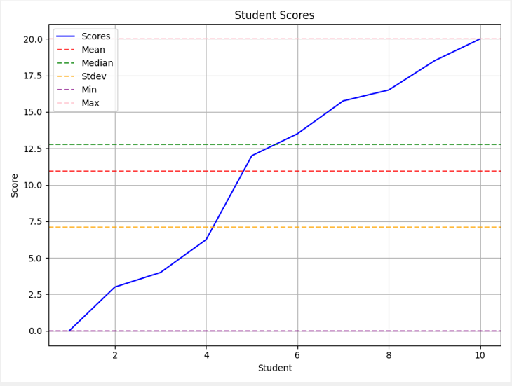

## Description
<!-- This program is designed to perform statistical analysis on a set of student scores. It prompts the user to input the number of students and their respective scores. After collecting the data, the program performs the following calculations:
- Sorting: It sorts the scores in ascending order.
- Average (Mean): It calculates the average (mean) score for the students.
- Median: It calculates the median score, which is the middle value in the sorted list. If there's an even number of scores, it takes the average of the two middle values.
- Standard Deviation: It computes the standard deviation, a measure of the amount of variation or dispersion in the scores.
- Minimum and Maximum: It finds the minimum and maximum scores in the dataset.
- Range: It calculates the range, which is the difference between the maximum and minimum scores.
- Scores Above Average: It creates a list of scores that are above the calculated average.  

After performing these calculations, the program displays the sorted scores, the mean, median, standard deviation, minimum, maximum, range, and the list of scores above the average to provide a comprehensive overview of the student performance.-->
This program allows you to perform statistical analysis on a set of student scores, providing valuable insights into their performance. It covers essential statistics, including sorting, mean, median, standard deviation, minimum, maximum, range, and scores above average.  

Please note that the user interface may require further enhancements to make the program more user-friendly, including a larger entry field, an expanded text box for the statistical results, and improved graph positioning.
## Usage
**Prerequisites:**
- Ensure you have Python installed.  
- Install required libraries using pip: ``pip install tkinter matplotlib``  

**Cloning the Repository:**
- To get started, clone this repository to your local machine using the following command:  
  ``git clone https://github.com/er-hiba/Students_Scores.git``

**Running the Program:**
- Navigate to the project directory: ``cd src``
- Execute the Python script: `python main.py`
- Input student scores, separated by spaces, in the provided text entry field.
- Click "Calculate" to trigger the analysis.
- View statistical results and a graphical representation of the data.
## Example
**Statical results:**  
   
**Graph:**  

