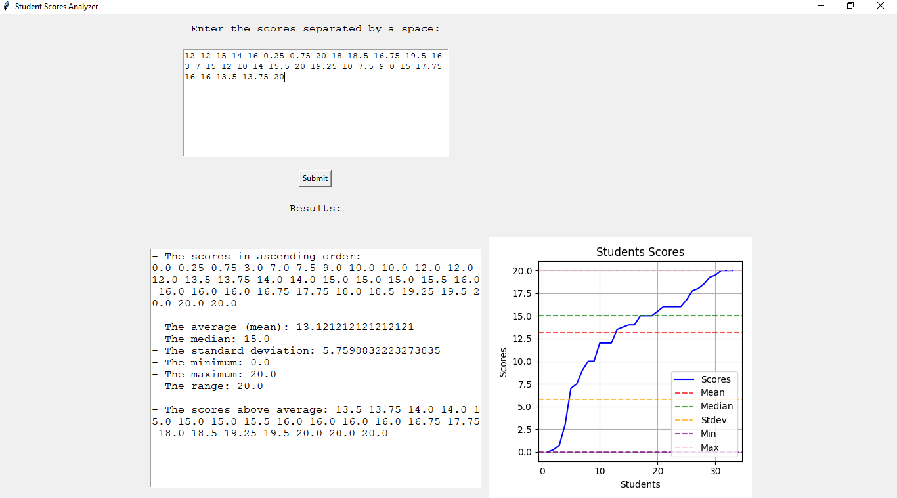
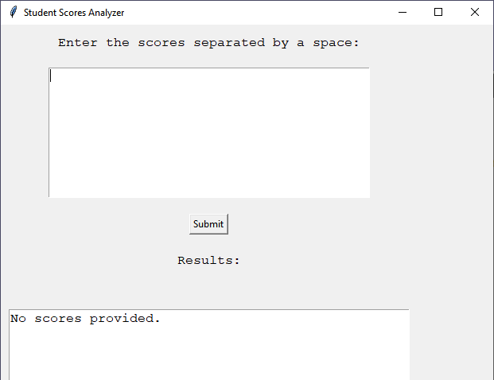

## Description
This is a Python application that provides a user-friendly interface using Tkinter. It enables users to input a series of student scores, conducts comprehensive statistical analysis (including mean, median, standard deviation, minimum, maximum, and range), and showcases the results both in textual and graphical formats. The program generates a plot illustrating the distribution of scores along with horizontal lines denoting various statistical measures for a quick overview of the dataset's characteristics.

## Screenshots

## Usage
**Prerequisites:**
- Ensure you have Python installed.  
- Install required libraries using pip: ``pip install tkinter matplotlib``  

**Cloning the Repository:**
- To get started, clone this repository to your local machine using the following command:  
  ``git clone https://github.com/er-hiba/Students_Scores.git``

**Running the Program:**
- Navigate to the project directory: ``cd src``
- Execute the Python script: `python main.py`
- Input student scores, separated by spaces, in the provided text entry field.
- Click "Submit" to trigger the analysis.
- View statistical results and a graphical representation of the data.
